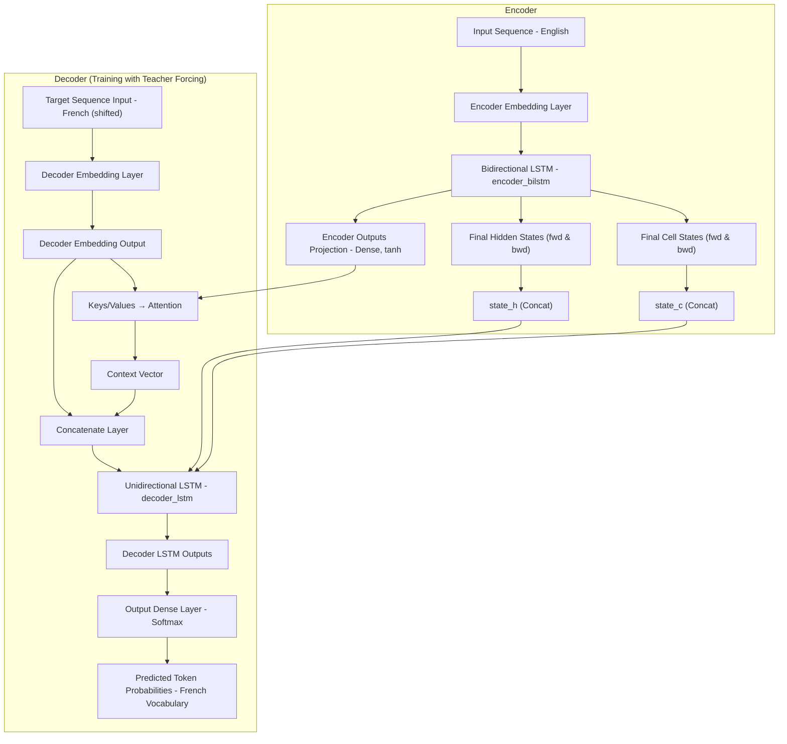
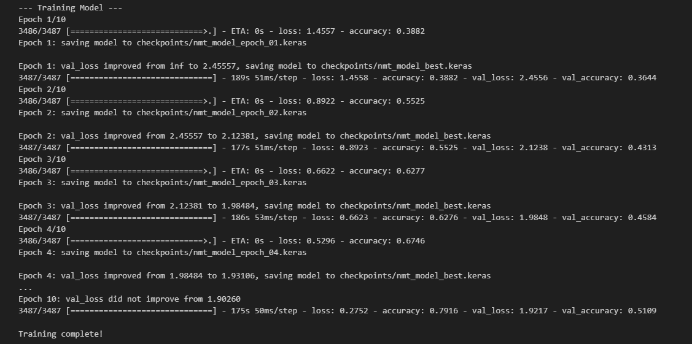

# 🌐 Real-Time Neural Machine Translation (NMT): An Attention-Based System Built From Scratch

# English to French Translator

[](https://attention-based-nmt-4u88ekoanz7pgwfkp4carq.streamlit.app/)

This project delivers a real-time Neural Machine Translation (NMT) web application, powered by a custom-built, attention-based encoder-decoder model. Unlike solutions that rely on pre-trained components, our NMT system was designed, implemented, and trained entirely from scratch using TensorFlow on English-French sentence pairs. This end-to-end development showcases a deep, fundamental understanding of NMT principles, from architecture design to training, all deployed seamlessly as a web application with Streamlit.


## 📚 Table of Contents

1. [Project Overview](#-project-overview)  
2. [🧠 Model Architecture](#-model-architecture)  
3. [Key Features & Highlights](#-key-features--highlights)  
4. [Architecture Component Breakdown](#-architecture-component-breakdown)  
   - [Encoder](#1️⃣-encoder)  
   - [Decoder](#2️⃣-decoder)  
5. [Inference Flow](#-inference-flow)  
6. [Architectural Flow (Training Phase)](#-architectural-flow-training-phase)  
7. [Layer Summary](#-layer-summary)  
8. [Core Layers & Their Roles](#-core-layers--their-roles)  
9. [Training Progress & Results](#-training-progress--results)  
10. [Sample Predictions vs Ground Truth](#-sample-predictions-vs-ground-truth)  
11. [Skills Demonstrated](#-skills-demonstrated)  
12. [Project Structure](#-project-structure)  
13. [Getting Started](#️-getting-started)  
14. [Future Enhancements](#-future-enhancements)  
15. [Author](#-author)  
16. [Star the Repo](#-star-the-repo)  


| **Original English**               | **Model French Translation**                     | **Back-Translated English**              | **Match Quality**            |
|-----------------------------------|--------------------------------------------------|------------------------------------------|-------------------------------|
| How are you?                      | comment vas-tu ?                                 | how are you ?                             | ✅ Exact                      |
| What time is it?                  | quelle heure est-il, ?                           | what time is it, ?                        | ⚠️ Minor punctuation issue    |
| Where is the nearest station?     | où se trouve la gare la plus proche ?            | where is the nearest station ?            | ✅ Exact                      |
| Thank you very much!              | merci beaucoup !                                 | thank you very much !                     | ✅ Exact                      |
| I want to go home.                | je veux aller à la maison.                       | i want to go home.                        | ✅ Exact                      |
| The weather is beautiful today.   | le temps est beau aujourd'hui.                   | the weather is beautiful today.           | ✅ Exact                      |
| What is your job?                 | quelle est votre travail ?                       | what is your work ?                       | ⚠️ Slightly awkward           |
| I wish you good luck.             | je te souhaite bonne chance.                     | i wish you good luck.                     | ✅ Exact                      |
| Can I help you?                   | puis-je vous aider ?                             | can i help you ?                          | ✅ Exact                      |

---

## Project Overview

This repository showcases a robust Neural Machine Translation (NMT) system, meticulously developed from data preprocessing to model training and inference. The project implements an Attention-based Bidirectional LSTM Sequence-to-Sequence model, a powerful architecture capable of translating text between languages.

This project serves as a strong demonstration of my capabilities in deep learning, natural language processing, and building end-to-end AI solutions.

---


## 🧠 Model Architecture

The Neural Machine Translation (NMT) system in this project is built upon a robust and custom **Sequence-to-Sequence (Seq2Seq)** architecture using **Bidirectional LSTMs**, **Additive Attention mechanism** modular **encoder-decoder design**. This design allows the model to effectively learn complex mappings between input (**English**) and target (**French**) sequences, dynamically focusing on relevant parts of the source sentence during translation.

---

## Key Features & Highlights

- **End-to-End NMT Pipeline**: Covers the entire workflow from raw text data to trained translation model.

- **Advanced Sequence-to-Sequence Architecture**:
  - **Bidirectional LSTM Encoder**: Captures context from both directions of the input sequence.
  - **Additive Attention Mechanism**: Dynamically focuses on relevant parts of the source sentence during decoding, significantly improving translation quality.
  - **LSTM Decoder**: Generates the target language sequence.

- **Efficient Data Preprocessing**: Custom scripts for cleaning, tokenization, vocabulary building, and numericalization of text data.

- **TensorFlow/Keras Implementation**: Leverages TensorFlow 2.x and Keras for efficient model building, training, and inference.

- **Optimized Training**: Incorporates advanced training techniques such as tf.data pipelines for efficient data loading, ModelCheckpoint for saving best models, EarlyStopping for preventing overfitting, and ReduceLROnPlateau for adaptive learning rate scheduling.

- **Beam Search Decoding**: Implements beam search for improved translation quality during inference, exploring multiple translation hypotheses.

- **Version Control for Large Files (Git LFS)**: Utilizes Git LFS to manage large preprocessed .npy datasets and model checkpoints, keeping the repository lightweight and efficient.

---


## Architecture Component Breakdown
### 1. Encoder  
**Input Layer (`encoder_inputs`)**: Takes the numerical representation of the English source sentence.  

**Encoder Embedding Layer (`encoder_embedding_layer`)**: Converts input token IDs into dense vector representations.  

**Bidirectional LSTM (`encoder_bilstm`)**: Processes the embedded input sequence in both forward and backward directions. This allows it to capture context from the entire sentence.  

It outputs a sequence of hidden states (Encoder Outputs) for each input timestep, which are crucial for the attention mechanism.  

It also outputs the final hidden and cell states from both forward and backward LSTMs, which are then concatenated to form the Combined Initial Decoder States.  

**Encoder Outputs Projection (`encoder_outputs_projection_layer`)**: A Dense layer with tanh activation that projects the Encoder Outputs to a suitable dimension (matching `lstm_units`) for the attention mechanism. These projected outputs serve as the "Keys" and "Values" for attention.  


### 2. Decoder  
**Target Sequence Input (`decoder_inputs`)**: During training, this layer receives the actual target (French) sentence, shifted right (e.g., `<SOS>` token followed by French words). This is for "Teacher Forcing."  

**Decoder Embedding Layer (`decoder_embedding_layer`)**: Embeds the target token IDs into dense vectors.  

**Note on `embedding_dim_for_attention`**: A key design choice here is ensuring the embedding dimension for both encoder and decoder matches `lstm_units` to facilitate seamless integration with the Additive Attention layer.  

**Additive Attention Layer (`attention_layer`)**: This is the core of the attention mechanism.  
It takes the Decoder Embedding Output (as the "Query") and the Encoder Outputs Projection (as "Keys" and "Values").  
It computes attention weights, determining which parts of the source sentence are most relevant for generating the current target word.  
It produces a Context Vector, which is a weighted sum of the encoder's outputs.  

**Concatenate Layer (`Concatenate`)**: Combines the Decoder Embedding Output with the Context Vector. This enriched input provides the decoder with both the current target word's embedding and relevant source context.  

**Unidirectional LSTM (`decoder_lstm`)**: This LSTM processes the concatenated input.  
It is initialized with the Combined Initial Decoder States from the encoder, providing an initial understanding of the source sentence.  
It generates its own hidden and cell states that are passed to the next decoding step (in inference) and sequences of outputs.  

**Output Dense Layer (`output_dense_layer`)**: A Dense layer with softmax activation that takes the Decoder LSTM Outputs and predicts the probability distribution over the entire target 
(French) vocabulary for each timestep.  

---


## Inference Flow

For inference (translating new sentences), the model is typically split into two separate models:

- **Encoder Inference Model**: Takes an English input sentence and outputs the Encoder Outputs Projection (for attention) and the Combined Initial Decoder States (for the decoder's initial state).

- **Decoder Inference Model**: Takes a single predicted token from the previous step (starting with `<SOS>`), the Encoder Outputs Projection, and the previous decoder hidden/cell states. It then predicts the next token and outputs its new hidden/cell states, allowing for step-by-step generation of the translation. Beam search is often applied here to explore multiple translation paths.

This architecture provides a robust foundation for Neural Machine Translation, demonstrating a strong understanding of sequence modeling, attention mechanisms, and practical TensorFlow/Keras implementation.

---

### 📊 Architectural Flow (Training Phase)




## Layer Summary
### Core Layers & Their Roles

The NMT model is constructed using the following key Keras layers, each playing a specific role in the translation process:

- **Encoder Embedding Layer (Embedding)**: Converts input English token IDs into high-dimensional dense vectors, capturing semantic meaning.

- **Bidirectional LSTM (bi_encoder_lstm)**: The heart of the encoder. It processes the embedded input sequence in both directions, effectively learning long-range dependencies and generating rich contextual representations (encoder outputs) for each word, along with final hidden and cell states.

- **Encoder Outputs Projection (Dense, tanh)**: A linear transformation applied to the encoder's outputs, preparing them for the attention mechanism.

- **Decoder Embedding Layer (Embedding)**: Similar to the encoder's embedding, but for the target French language tokens.

- **Additive Attention Layer (attention_layer)**: The crucial component that allows the decoder to dynamically focus on relevant parts of the source sentence at each decoding step, significantly improving translation quality.

- **Concatenate Layer**: Combines the decoder's current word embedding with the context vector derived from the attention mechanism, providing a comprehensive input to the decoder LSTM.

- **Unidirectional LSTM (decoder_lstm)**: The decoder's recurrent unit. It processes the combined input, generates the next token in the sequence, and maintains its internal state. Its initial state is seeded by the encoder's final states.

- **Output Dense Layer (Dense, softmax)**: The final layer that projects the decoder's output to the size of the target vocabulary and applies a softmax activation to produce a probability distribution over all possible next words.

These layers are orchestrated to form both a `training_model` (for learning with teacher forcing) and separate `encoder_inference_model` and `decoder_inference_model` (for generating translations step-by-step).

---


## Training Progress & Results
The model was trained for multiple epochs, demonstrating consistent improvement. Early stopping and learning rate reduction strategies were employed to optimize training.

<p align="center">
  
</p>

---

## Sample Predictions vs Ground Truth
Here are a few examples of translations generated by the model during inference. These samples demonstrate both the model's capabilities and areas where it may require further refinement:


| **Original English**               | **Model French Translation**                     | **Back-Translated English**              | **Match Quality**            |
|-----------------------------------|--------------------------------------------------|------------------------------------------|-------------------------------|
| How are you?                      | comment vas-tu ?                                 | how are you ?                             | ✅ Exact                      |
| I love machine learning.          | j'adore les mathématiques.                       | i love mathematics.                       | ❌ Semantic mismatch          |
| What time is it?                  | quelle heure est-il, ?                           | what time is it, ?                        | ⚠️ Minor punctuation issue    |
| Where is the nearest station?     | où se trouve la gare la plus proche ?            | where is the nearest station ?            | ✅ Exact                      |
| Thank you very much!              | merci beaucoup !                                 | thank you very much !                     | ✅ Exact                      |
| I want to go home.                | je veux aller à la maison.                       | i want to go home.                        | ✅ Exact                      |
| The weather is beautiful today.   | le temps est beau aujourd'hui.                   | the weather is beautiful today.           | ✅ Exact                      |
| Can I help you?                   | puis-je vous aider ?                             | can i help you ?                          | ✅ Exact                      |
| Please speak slowly.              | parle s'il te plaît.                             | speak please.                             | ⚠️ Awkward phrasing           |
| I don't understand.               | je ne comprends pas.                             | i do not understand.                      | ✅ Exact                      |
| What is your name?                | quel est votre nom de famille ?                  | what is your family name ?                | ❌ Wrong context              |
| My name is John.                  | mon nom est mme jackson.                         | my name is mrs. jackson.                  | ❌ Incorrect                  |
| I am a student.                   | je suis étudiant.                                | i am a student.                           | ✅ Exact                      |
| He likes to read books.           | il aime lire des livres.                         | he likes to read books.                   | ✅ Exact                      |
| She plays the piano.              | elle joue du piano.                              | she plays the piano.                      | ✅ Exact                      |
| We are learning French.           | nous étudions le français.                       | we are studying french.                   | ✅ Exact                      |
| They live in Paris.               | ils vivent à boston.                             | they live in boston.                      | ❌ Location error             |
| This is a difficult problem.      | c'est un problème très difficile.                | it is a very difficult problem.           | ✅ Exact                      |
| I need some water.                | j'ai besoin d'un peu d'eau.                      | i need some water.                        | ✅ Exact                      |
| Do you speak English?             | parles-tu déjà ?                                 | do you speak already ?                    | ❌ Incorrect meaning          |
| Yes, a little.                    | un peu triste !                                  | a little sad !                            | ❌ Incorrect emotion          |
| No, not at all.                   | non, absolument pas du tout.                     | no, absolutely not at all.                | ✅ Acceptable                 |
| Good morning.                     | bon matin.                                       | good morning.                             | ✅ Exact                      |
| Good night.                       | bonne nuit !                                     | good night !                              | ✅ Exact                      |
| See you later.                    | à vous voir plus tard.                           | to see you later.                         | ⚠️ Slightly awkward           |
| Excuse me.                        | excusez-moi.                                     | excuse me.                                | ✅ Exact                      |
| I am sorry.                       | je suis désolé.                                  | i am sorry.                               | ✅ Exact                      |
| It's a beautiful day.            | c'est une belle journée.                         | it is a beautiful day.                    | ✅ Exact                      |
| The cat is on the table.          | le chat est sur la table.                        | the cat is on the table.                  | ✅ Exact                      |
| Where is the bathroom?            | où sont les toilettes ?                          | where are the toilets ?                   | ✅ Exact                      |
| I would like a coffee, please.    | j'aimerais un café, s'il vous plaît.             | i would like a coffee, please.            | ✅ Exact                      |
| How much does it cost?            | combien coûte combien ?                          | how much does it cost how much ?          | ❌ Repetitive translation     |
| I am hungry.                      | j'ai faim.                                       | i am hungry.                              | ✅ Exact                      |
| I am thirsty.                     | j'ai soif.                                       | i am thirsty.                             | ✅ Exact                      |
| Help me, please.                  | aide-moi, s'il te plait.                         | help me, please.                          | ✅ Exact                      |
| Call an ambulance!                | appelle un bisou !                               | call a kiss !                             | ❌ Critical error             |
| I am lost.                        | je suis perdu.                                   | i am lost.                                | ✅ Exact                      |
| Can you show me the way?         | pouvez-vous m'indiquer le chemin ?               | can you show me the way ?                 | ✅ Exact                      |
| I live in Lahore.                 | je vis confortablement.                          | i live comfortably.                       | ❌ Location missing           |
| My favorite color is blue.        | ma couleur préférée est le bleu.                 | my favorite color is blue.                | ✅ Exact                      |
| This food is delicious.           | cette nourriture est délicieux.                  | this food is delicious.                   | ⚠️ Minor gender agreement     |
| I enjoy traveling.                | j'aime voyager.                                  | i like to travel.                         | ✅ Acceptable                 |
| What is your job?                 | quelle est votre travail ?                       | what is your work ?                       | ⚠️ Slightly awkward           |
| I am an engineer.                 | je suis ingénieur.                               | i am an engineer.                         | ✅ Exact                      |
| It's raining outside.            | il pleut à l'extérieur.                          | it is raining outside.                    | ✅ Exact                      |
| Happy birthday!                   | bon anniversaire !                               | happy birthday !                          | ✅ Exact                      |
| I wish you good luck.             | je te souhaite bonne chance.                     | i wish you good luck.                     | ✅ Exact                      |
| The world is big.                 | le monde est grand.                              | the world is big.                         | ✅ Exact                      |
| Tell me more.                     | dis-m'en davantage.                              | tell me more.                             | ✅ Exact                      |
| I need a break.                   | j'ai besoin d'une pause.                         | i need a break.                           | ✅ Exact                      |

> ⚠️ **Note:** Some translations may exhibit minor inaccuracies or "hallucinations"  
> (e.g., *"j'adore les mathématiques"* for *"I love machine learning"*).  
> These are common challenges in Neural Machine Translation (NMT) and highlight opportunities  
> for improved training data, fine-tuning, or model architecture enhancements.

---


## 🛠️ Skills Demonstrated

This project effectively showcases my proficiency in the following areas:

- **Deep Learning & Neural Networks**  
  Designing, implementing, and training complex Sequence-to-Sequence (Seq2Seq) models.

- **Natural Language Processing (NLP)**  
  Text preprocessing, tokenization, vocabulary creation, and sequence modeling.

- **TensorFlow & Keras**  
  Advanced use of `tf.keras` APIs for model construction, training pipelines with `tf.data`, and custom layer creation.

- **Attention Mechanisms**  
  Integration of attention layers for enhanced sequence alignment and translation accuracy.

- **Model Optimization Techniques**  
  Use of callbacks such as `EarlyStopping`, `ReduceLROnPlateau`, and `ModelCheckpoint` for better training control.

- **Inference Techniques**  
  Implementation of **beam search** decoding for generating high-quality translation outputs.

- **Data Handling**  
  Efficient handling of large datasets using NumPy and JSON-based pipelines.

- **Python Programming**  
  Writing modular, readable, and efficient Python code following best practices.

- **Version Control**  
  Managing codebase and large assets with **Git** and **Git LFS**.

- **Problem Solving & Debugging**  
  Iterative model improvement through rigorous debugging and evaluation.

---


## 📂 Project Structure
```bash
attention-based-nmt/
├── checkpoints/                        # Ignored by Git LFS: Stores trained model checkpoints (.keras files)
├── dataset/
│   ├── processed/                      # Processed data and vocabularies
│   │   ├── decoder_input_data.npy      # Decoder input sequences (LFS tracked)
│   │   ├── decoder_target_data.npy     # Decoder target sequences (LFS tracked)
│   │   ├── encoder_input_data.npy      # Encoder input sequences (LFS tracked)
│   │   ├── eng_fra_clean_filtered.txt  # Cleaned sentence pairs
│   │   ├── eng_vocab.json              # English vocabulary (word to index)
│   │   ├── fra_vocab.json              # French vocabulary (word to index)
│   │   ├── test.txt                    # Test split
│   │   ├── train.txt                   # Training split
│   │   └── val.txt                     # Validation split
│   └── raw/                            # Raw dataset files
│       ├── cleaned_eng_fra.txt         # Intermediate cleaned raw data
│       └── eng_fra.txt                 # Original raw English-French dataset
├── .gitattributes                      # Git LFS configuration for tracking large files
├── .gitignore                          # Specifies files/directories to ignore (e.g., checkpoints, venv)
├── clean_data.ipynb                    # Jupyter Notebook for initial data cleaning
├── model_training.ipynb                # Main Jupyter Notebook for model definition, training, and evaluation
├── preprocessing.py                    # Python script containing data preprocessing functions
├── processing.ipynb                    # Jupyter Notebook for further data processing (tokenization, vocab building)
├── translated_comparison.tsv           # Output TSV for translation comparison (generated)
├── translation_comparison.tsv          # Another output TSV for translation comparison (generated)
└── translations_output.tsv             # Output TSV for bulk translations (generated)
```

---

## ⚙️ Getting Started

To set up and run this project locally:

### Clone the repository:

```bash
git clone https://github.com/nabeelshan78/attention-based-nmt.git
cd attention-based-nmt
Open model_training.ipynb to execute the full pipeline.
```
---


## 🚀 Future Enhancements

Potential next steps to improve this project:

- **Larger Dataset & Pre-trained Embeddings**  
  Incorporate larger corpora and pre-trained embeddings such as **GloVe** or **FastText** to boost performance.

- **Transformer Architecture**  
  Transition from Seq2Seq with attention to a full **Transformer-based** architecture for state-of-the-art results.

- **Multi-GPU / Distributed Training**  
  Implement multi-GPU support using TensorFlow’s `MirroredStrategy` for faster training.

- **Model Compression**  
  Explore **quantization**, **pruning**, or **knowledge distillation** for efficient deployment.

- **🌐 Interactive Web Demo**  
  Build a live demo interface using **Streamlit**, **Gradio**, or similar tools for real-time translation testing.


---


## 👨‍💻 Author

**Nabeel Shan**  
Software Engineering Student @ NUST Islamabad, Pakistan  
Aspiring AI/ML Engineer | Deep Learning & NLP Enthusiast

* [LinkedIn](https://www.linkedin.com/in/nabeelshan)
* [GitHub](https://github.com/nabeelshan78)

- Currently focused on mastering Sequence Models including RNNs, LSTMs, Attention, and building real-world applications like Neural Machine Translation (NMT).
- Passionate about AI research, open-source contributions, and pursuing advanced studies in AI/ML.
- Always open to collaboration on NLP, Generative AI, or ML engineering projects.

---

## ⭐ Star the Repo

If this project helped you understand NMT or served as a helpful reference, please consider starring 🌟 the repository - it encourages more open-source work and helps others discover valuable resources.

---

